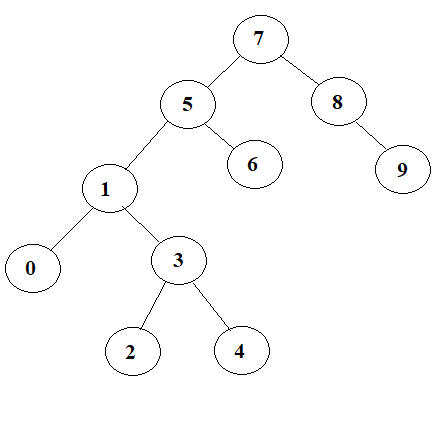

# Binary Search Tree

## [7, 5, 1, 8, 3, 6, 0, 9, 4, 2] dizisinin Binary-Search-Tree aşamalarını yazınız.
---

1- [7, 5, 1, 8, 3, 6, 0, 9, 4, 2] dizisinin 1.elemanı 7, root(kök) olarak belirlenir.

2- Dizinin 2.elemanı olan 5, 7'den küçük olduğu için 7'nin soluna yazılır.

3- Dizinin 3.elemanı olan 1, 7'den küçük olduğu için 7'nin soluna geçer. Sol tarafta bulunan ilk eleman 5'ten küçük olduğu için 5'in soluna yazılır.

4- Dizinin 4.elemanı olan 8, 7'den büyük olduğu için 7'nin sağına yazılır.

5- Dizinin 5.elemanı olan 3, 7'den küçük olduğu için 7'nin soluna geçer. Sol tarafta bulunan ilk eleman 5'ten küçük olduğu için 5'in soluna geçer. Sol tarafta bulunan ikinci eleman 1'den büyük olduğu için 1'in sağına yazılır.

6- Dizinin 6.elemanı olan 6, 7'den küçük olduğu için 7'nin soluna geçer. Sol tarafta bulunan ilk eleman 5'ten büyük olduğu için 5'in sağına yazılır.

7- Dizinin 7.elemanı olan 0, 7'den küçük olduğu için 7'nin soluna geçer. Sol tarafta bulunan ilk eleman 5'ten küçük olduğu için 5'in soluna geçer. Sol tarafta bulunan ikinci eleman 1'den küçük olduğu için 1'in soluna yazılır.

8- Dizinin 8.elemanı olan 9, 7'den büyük olduğu için 7'nin sağına geçer. Sağ tarafta bulunan ilk eleman 8'den büyük olduğu için 8'in sağına yazılır.

9- Dizinin 9.elemanı olan 4, 7'den küçük olduğu için 7'nin soluna geçer. Sol tarafta bulunan ilk eleman 5'den küçük olduğu için 5'in soluna geçer. Sol tarafta bulunan ikinci eleman 1'den büyük olduğu için 1'in sağına geçer. 1'in sağında 3 var. 3'den büyük olduğu için 3'ün sağına yazılır.

10- Dizinin 10.elemanı olan 2, 7'den küçük olduğu için 7'nin soluna geçer. Sol tarafta bulunan ilk eleman 5'den küçük olduğu için 5'in soluna geçer. Sol tarafta bulunan ikinci eleman 1'den büyük olduğu için 1'in sağına geçer. 1'in sağında 3 var. 3'den küçük olduğu için 3'ün soluna yazılır.

